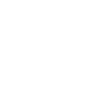
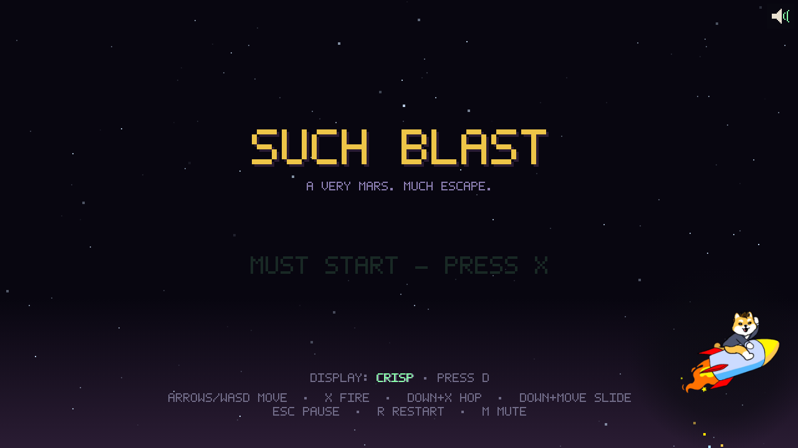
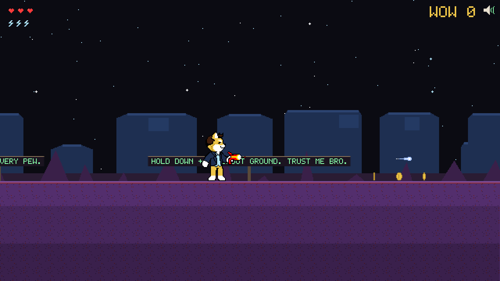
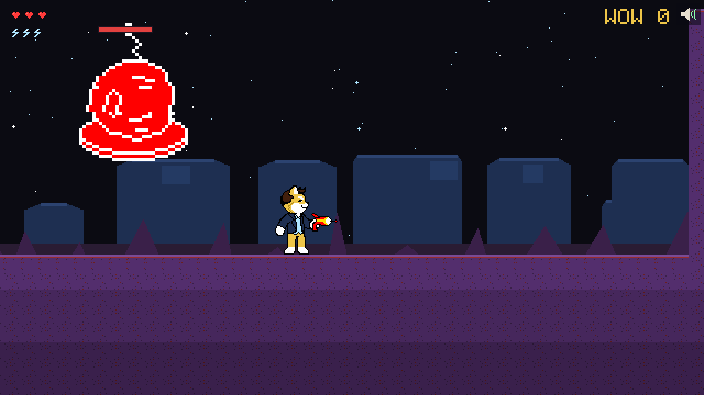
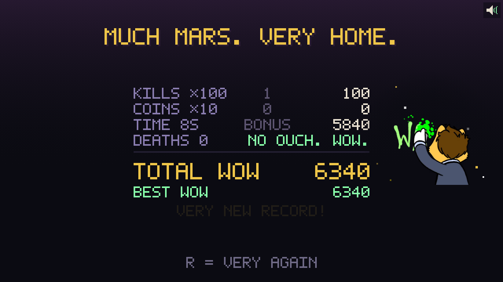
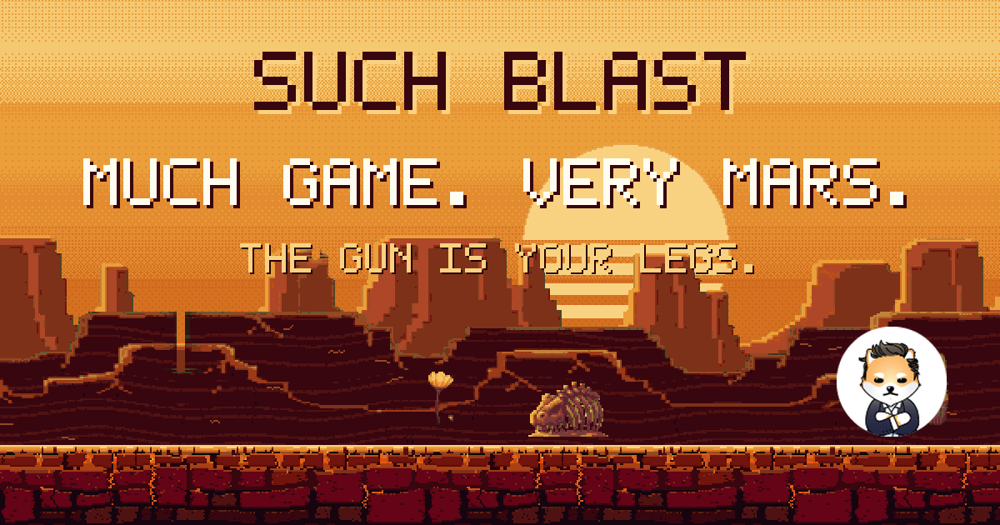

<!-- NOTE: refresh every screenshot in media/ after the Plan-6 visual overhaul pass -->
<p align="center">
  <br>
  
</p>

<h1 align="center">SUCH BLAST</h1>
<p align="center"><b>a VibeCon 2026 game. the gun is your legs. much blast.</b></p>

<p align="center">
  
  
  
  
  <br>
  
  
  
  
  
</p>

<p align="center">🎮 <b>PLAY:</b> <a href="https://vibecon-entry1.github.io/vibecon-entry/"><b>vibecon-entry1.github.io/vibecon-entry</b></a> 🎮</p>

---

## wow. what is this.

**SUCH BLAST** is our entry for **[VibeCon 2026](https://dogelonmars.com/blog/announcing-vibecon-2026-build-a-game-on-mars/)** — the Dogelon Mars community game jam. rude aliens invaded the canyon. the rescue ship is 1,488 tiles that way. you have one gun and it does *everything*.

- shoot **forward** → very pew
- shoot the **ground** → u fly (trust me bro)
- shoot the ground **in the air** → boost. 3 pips. kills refill. such economy.
- **slide + X** → zoom zoom
- press **S** on any end screen → your run, on your clipboard, as a link that
  unfurls into its own score card. much brag.
- there is **no jump button**. the gun is the jump button. this is the whole game.

31 chunks of hand-built Mars gauntlet with ramping difficulty, 39 rude aliens, 151 $ELON coins, a MEGA SAUCER boss that summons very minions, a ship extraction finale, and a soundtrack that streams like real games do it.

beat it once and **WOW ZONE** unlocks: an endless mode that re-deals the same hand-authored chunks in a seeded order that ramps from teaching-floor to tier-3 canyon. one life, no checkpoints, a pit is the end of the run. same seed = same 40 chunks, every time.

## much screenshots

| title | gauntlet |
|---|---|
|  |  |

| MEGA SAUCER. very rude. | MUCH MARS. VERY HOME. |
|---|---|
|  |  |

<p align="center"></p>

## how 2 play

```
←→ / AD     move
X / Z / ␣   blast (the only verb)
↓ + X       shoot ground = hop
↓+X in air  boost (watch the pips)
↓ + move    slide · keep holding + X = zoom zoom
W           WOW ZONE (endless — unlocks when you beat the gauntlet)
S           SHARE your run (end screens) — copies a link + a score card
Esc         such pause.    R  very restart    M  mute    D  display mode
```

3 hearts. pits cost a heart. 0 hearts = u ded (aliens come back, score gets docked — very fair). beatable in under 4 minutes (VibeCon requires entries playable in 1–5 — such compliance). your first clear will not be under 4 minutes.

## very tech

- **zero-dependency vanilla JS** — no engine, no framework, no build step. fixed 60Hz sim, deterministic input tapes, pixel-perfect DPR-aware rendering with a hand-authored 5×7 bitmap font
- **172 unit tests + 46 end-to-end browser tests** drive the actual game with frame-indexed input tapes and screenshot every milestone
- **no `Math.random` anywhere in the sim** — WOW ZONE deals its level from a seeded mulberry32 stream, so a run is a pure function of one integer and an input tape replays it exactly
- levels are ASCII art. the atlas is built by a Python pipeline that recovers native pixels losslessly from the official sheets. every gap in every level is machine-verified clearable before a human ever plays it
- music streams progressively (Range/206) — nothing preloads, just like the big games do it
- **share cards are generated art too**: nine tier cards + the banner above come
  out of `tools/gencards.py`, typeset in the game's own 5x7 bitmap font over the
  game's own parallax Mars. A link to a run goes through a 120-line stateless
  Cloudflare worker (`share-worker/`, deployed with two curls and no wrangler)
  that rewrites the OpenGraph tags to that run's score

## run it yourself

```bash
npm install        # dev deps only (test runner) — the game itself has zero dependencies
npm run serve      # → http://localhost:8123
npm test           # 172 unit + 46 e2e browser tests, much green
```

## built with much AI

this is an AI-assisted jam entry (that's the whole point of VibeCon). the humans made the calls; the models made the commits:

| part | model |
|---|---|
| game design, orchestration, code review loops | Claude Opus 5 |
| player verb state machine, boss, level design, scene wiring, rendering passes | Claude Opus 5 |
| systems (enemies, coins, score, audio engine), test suites, most implementation | Claude Sonnet 5 |
| mechanical fixes, scaffolding, docs | Claude Haiku 4.5 |
| soundtrack | Suno (commercial license) |

all of it ran on a Claude Pro subscription at medium effort level. every feature ran a two-stage review (spec compliance → code quality) with adversarial verification before merging. the reviews caught 30+ real bugs before any human ever hit them. such process.

## very credits

- **Dogelon Mars** — the official character sprites, ship, enemies and effects are from the [VibeCon asset pack](https://dogelonmars.com/blog/announcing-vibecon-2026-build-a-game-on-mars/), and the logo + stickers are from the official [dogelon-assets](https://github.com/DogelonMars/dogelon-assets) repo. wow. thank you.
- everything else (tileset, parallax Mars, coins, hearts, UI, fonts) — generated pixel art, palette-locked to the official sprites
- made for the Dogelon Mars community. much love. very mars. 🚀

## license

code + generated pixel art: **MIT**. the Dogelon Mars character sprites, ship, enemies,
logo and stickers remain **© Dogelon Mars**, used under the VibeCon 2026 jam terms — see
[LICENSE](LICENSE). such lawyer.
